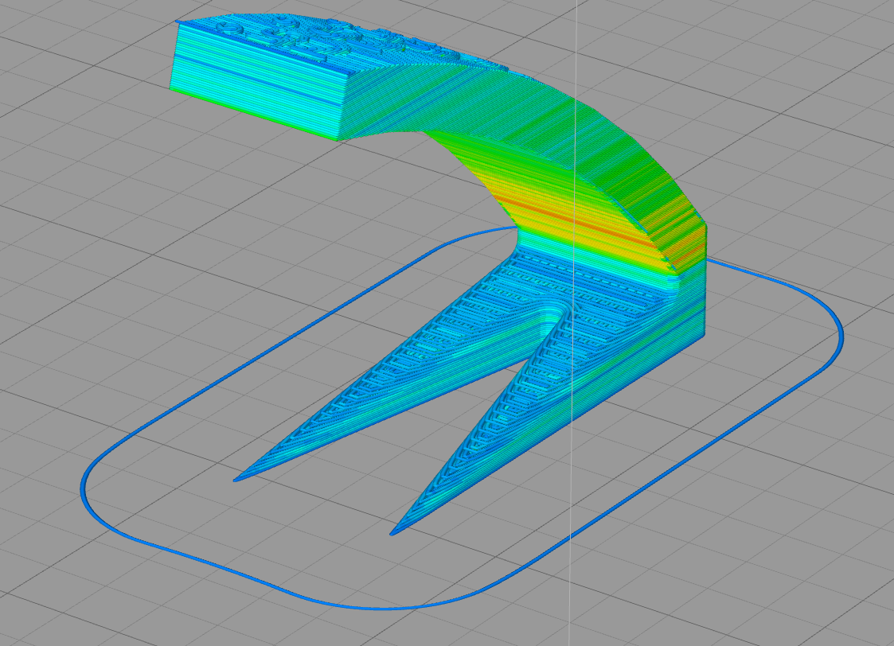
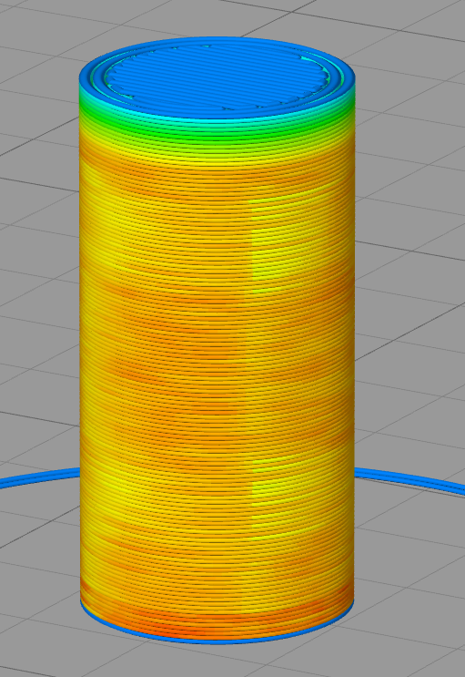

# Thermal simulation of an FDM 3d printing process

Thermal simulation of printing processes in additive manufacturing is usually done using FEM. However, when the printing process is using segments which are added sequentially it is in my opinion easier to just simulate those segments/roads instead of generic "elements". Also the temporal effect can be easily be calculated using this method. I came up with that idea a long time ago but only implemented it after I found Yaqi Zhangs work which is used as base for this implementation. 

Contents:
- simulator.py: This is the actual application.
  - Input: Gcode file containing G1 instructions describing a part which can be 3d printed
  - Output: The input file where the speed values are replaced by the duration in which the segment has a higher temperature than it's HDT temperature. When a plastic material has a temperature higher than its HDT then it is not solid and the dimensions of the printed part will change depending on the duration above HDT.
- Directory "reference": Contains code from Yaqi Zhang. I ported his code from javascript to python and extended it.
  https://scholar.google.com/citations?user=VLgSItEAAAAJ&hl=en
- Directory "sample-input-output": Contains sample input gcode files and some results.
- Directory "theejs-gcode-viewer": My failed attempt to implement a gcode viewer in Javascript

Limitations:
- Performance is quite bad. I implemented it with the goal of understanding the physical simulation. For better performance reimplement it using numpy or another programming language.
- Some physical effects are not taken into account: For example in a typical FDM printer the nozzle pushes quite a bit of heat additionally into the extruded material.
- Empirical observations show that corners and overhangs are overheating faster than other parts. This is currently not working in the simulation. The thermal conduction in the part is currently possibly too high leading to a bad resolution in x-y plane.

###Sample output images from the exported gcode files:
- Image 1: Overheating visible where the minimum layer duration of Cura (used in the area with the lowest cross-section) stops working  because the overhangs are printed with slower speed.

- Image 2: The yellow areas in the middle of the cylinder are the first extrusion of their layer. They are colder because the material in the layer below cooled down. The green area on top of the cylinder is the effect of printing solid layers on top of the mostly hollow cylinder.
- 